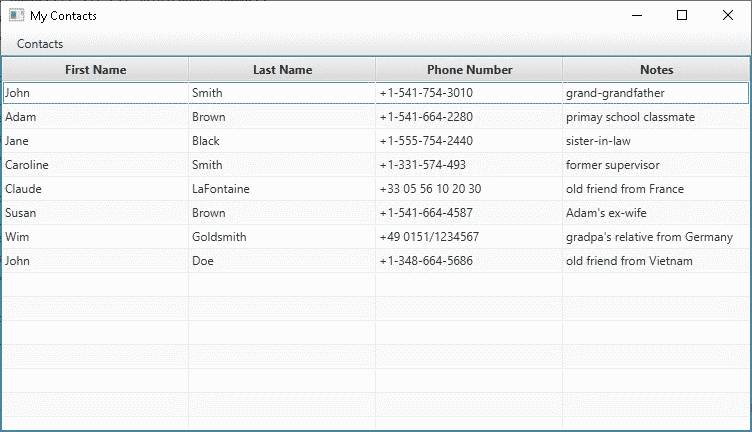
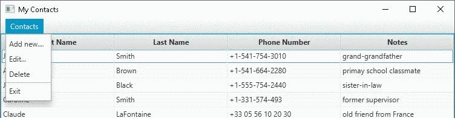
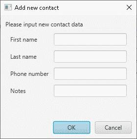

# Overview

MyContacts - Simple Contact Book with UI (JavaFX) using xml file as datasource - project under development




### Requirements:

- Java 11

### How to run

- clone and download repository
- make sure you have switched to Java 11*
- go to project file (/myContacts/) - make sure you see folder "target" and file "contacts.xml"
- while in "myContacts" folder, run jar file from console using: 
```
java -jar target/mycontacts-1.0-SNAPSHOT.jar
```


_*due to an error in Maven plugin "maven-compiler-plugin" app doesn't work with Java 12 and higher so far_


## Features implemented so far

### File Menu

Simple popup menu with te following features:

- "Add new" - add a new contact to database
- "Edit" - edits selected contact
- "Delete" - deletes selected contact
- "Exit" - exits application



### Add new contact dialog

Simple window to get data from user (same component is used when user wants to edit contact)




## Known bugs (to be fixed in next update)

- InvocationTargetException when user wants to edit contat without selecting one (after he accepts warning message)
